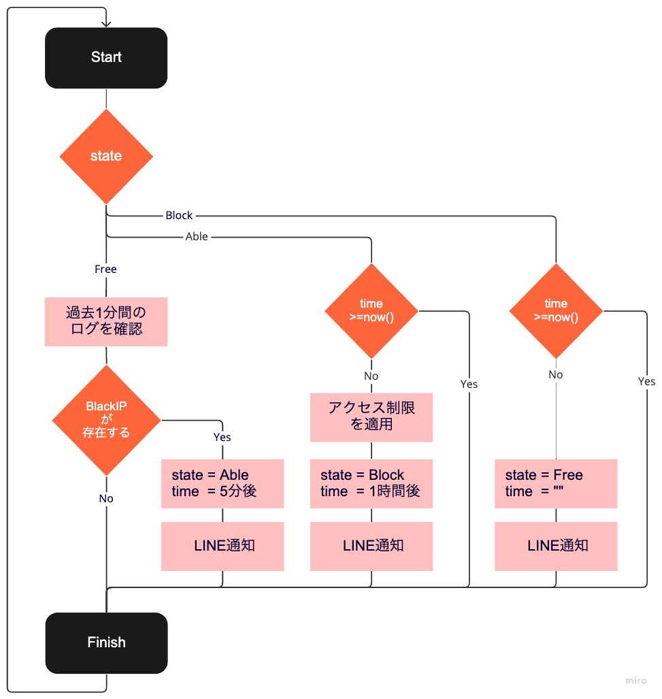

# proxy-blacklist-raspberrypi
Raspberry Piをプロキシサーバーにして、特定のドメイン（各種SNS）における利用時間の制限を行う。<br>
※ 時間の浪費防止

## 仕様


### ◇ stateの種類
* Free：フリー時間
* Able：利用可能時間
* Block：利用不可能時間

※ BlockIP：時間制限を行なっているIP（ドメイン）

## Raspberry Piの設定
### ◇ Raspberry PiのIPアドレスを固定にする
* [Raspberry Pi のIPアドレスを固定にするには？](https://www.fabshop.jp/raspberry-pi-static-ip/)

### ◇ [Squid](http://www.squid-cache.org/) のインストール
```bash
sudo apt-get update
sudo apt-get upgrade -y
sudo apt-get install squid -y
sudo apt-get install jq -y
```

### ◇ Squidの設定
1. 設定ファイルの権限変更
    ```bash
    $ sudo chmod 777 /etc/squid/squid.conf
    ```
2. `/etc/squid/squid.conf`を編集<br>
    ⇒ [squid.conf](/squid.conf)
3. `/etc/squid/ManageAccess.sh`を作成<br>
    ⇒ [ManageAccess.sh](/ManageAccess.sh)
4. `/etc/squid/AccessState.json`を作成<br>
    ⇒ [AccessState.json](AccessState.json)
5. `/etc/squid/blacklist`を作成<br>
    ⇒ [blacklist](/blacklist)

### ◇ 自動起動設定と設定ファイルの反映
```bash
$ sudo systemctl enable squid.service
$ sudo systemctl restart squid.service
```

### ◇ cronの設定
```bash
* * * * * bash /etc/squid/ManageAccess.sh
```

## ◇ アクセスログの確認
```bash
$ sudo tail /var/log/squid/access.log
```

## iPhoneのプロキシ利用設定
* [iPhoneでWi-Fiの接続時にプロキシを使うよう設定する方法](https://novlog.me/ios/proxy/)<br>
    * サーバ：Raspberry Pi固定IP
    * ポート：3128（[squid.conf](/squid.conf) に記載）

## 参考
* [【ラズベリーパイ4】Squidでプロキシサーバを自作する方法](https://algorithm.joho.info/raspberry-pi/squid-raspberry-pi/)
* [Raspberry PiをHTTP/HTTPSプロキシサーバーにしてみた](https://qiita.com/mascii/items/400a0ecab61d885ac2a8)
* [Web プロキシサーバ Squid を利用して、特定のサイト・時間帯・曜日にアクセスできないようにする](https://zenn.dev/noraworld/articles/access-restriction-using-squid)
